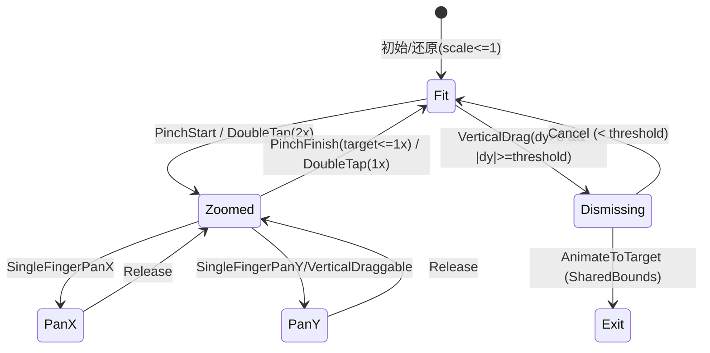

# ComposeRefine

与Refine类似，是Compose的学习项目

## 设计文档
- 完整文档见 docs/DESIGN.md

## 架构图与交互图（Mermaid + PNG 导出）
本仓库已提供 Mermaid 源文件，GitHub 将直接渲染如下代码块；如需 PNG，请见下方导出命令。

### 架构概览（Overlay + 状态流向）
```mermaid
%% 源文件：docs/diagrams/architecture.mmd
flowchart LR
  subgraph MediaGridFeature
    G[LazyGrid (MediaGridScreen)]
    S1[(thumbBoundsByUri)]
    S2[(previewUrls / previewFocusUri)]
    S3[(previewStartBounds)]
    S4[(previewExitTargetBounds)]
    S5[(blankUri)]
    S6[(gridInitialIndex/Offset)]
    G -- onItemClick --> P
    G -- onItemBounds(uri,bounds) --> S1
  end
  subgraph Overlay: ImagePagerScreen
    P[Pager + ZoomableImage]
    O[SharedBoundsOverlay]
  end
  S2 -. startIndex .-> P
  S3 -. entryStartBounds .-> P
  S4 -. exitTargetBounds .-> P
  P -- onPageChanged(page,url) --> MediaGridFeature
  P -- onExitStart(url) --> S5
  P -- onExitBlankingChange(url,active) --> S5
  MediaGridFeature -- derive/compute --> S4
  MediaGridFeature -- restore grid when needed --> G
  O -. draw entry/exit .- P
```

### 手势状态机（放大态/适配态、下拉/上拉、嵌套滚动）


### 共享边界目标决策树
```mermaid
%% 源文件：docs/diagrams/bounds_decision.mmd
flowchart TD
  A[当前页 url] --> B{是否为入场项?}
  B -- Yes --> C[静默恢复网格到初始位置]
  C --> D{当前 url 在网格中可见?}
  D -- Yes --> E[目标=thumbBoundsByUri[url]]
  D -- No  --> F[目标=previewStartBounds(回退)]
  B -- No --> G{目标项当前是否可见?}
  G -- Yes --> H[目标=thumbBoundsByUri[url]]
  G -- No  --> I[滚动到目标 index 并更新 bounds]
  E --> J[下发 exitTargetBounds]
  F --> J
  H --> J
  I --> J
```

### PNG 导出
可选两种方式导出 PNG（二选一）：
- 方式 A：npx mermaid-cli（需要 Node 环境）
  - 安装与导出（将在项目根目录生成 PNG）：
    - 安装：`npm i -D @mermaid-js/mermaid-cli`（需要许可）
    - 导出：
      - `npx mmdc -i docs/diagrams/architecture.mmd -o docs/diagrams/architecture.png`
      - `npx mmdc -i docs/diagrams/state_machine.mmd -o docs/diagrams/state_machine.png`
      - `npx mmdc -i docs/diagrams/bounds_decision.mmd -o docs/diagrams/bounds_decision.png`
- 方式 B：Docker（无需本地 Node）：
  - `docker run --rm -v "$PWD":/data minlag/mermaid-cli mmdc -i /data/docs/diagrams/architecture.mmd -o /data/docs/diagrams/architecture.png`
  - 其他图同理替换输入输出路径

导出后，即可在 README 或文档中以图片形式引用：
- ``
- ``
- ``
