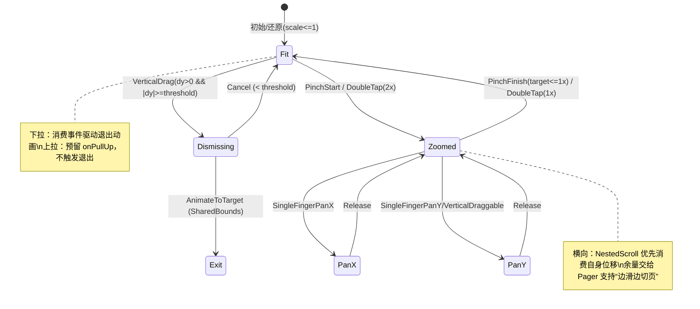

# ComposeRefine – 媒体网格 & 预览 交互设计文档

本设计文档总结了媒体缩略图网格与大图预览的整体架构、数据/状态流向、手势时序与状态机、共享边界目标（bounds）决策树、以及与 LazyGrid 可见性/复用的交互要点。最后附各 feature 模块的特性清单与实现思路。

---

## 架构概览（Overlay 架构、数据/状态流向）

- UI 架构：主界面为 MediaGrid（缩略图网格），预览以 Overlay 的方式覆盖在其上（ImagePagerScreen）。
- 共享边界（Shared Bounds）：入场/退出均由预览侧的 Overlay 绘制实现；底层内容在 Overlay 可见时设 alpha=0 以避免重影。
- 数据与状态：由 MediaGridFeature 统一维护并与预览联动。

```mermaid
flowchart LR
  subgraph MediaGridFeature
    G[LazyGrid (MediaGridScreen)]
    S1[(thumbBoundsByUri)]
    S2[(previewUrls / previewFocusUri)]
    S3[(previewStartBounds)]
    S4[(previewExitTargetBounds)]
    S5[(blankUri)]
    S6[(gridInitialIndex/Offset)]
    G -- onItemClick --> P
    G -- onItemBounds(uri,bounds) --> S1
  end

  subgraph Overlay: ImagePagerScreen
    P[Pager + ZoomableImage]
    O[SharedBoundsOverlay]
  end

  S2 -. startIndex .-> P
  S3 -. entryStartBounds .-> P
  S4 -. exitTargetBounds .-> P
  P -- onPageChanged(page,url) --> MediaGridFeature
  P -- onExitStart(url) --> S5
  P -- onExitBlankingChange(url,active) --> S5
  MediaGridFeature -- derive/compute --> S4
  MediaGridFeature -- restore grid when needed --> G
  O -. draw entry/exit .- P
```

关键说明：
- 打开预览：记录 grid 初始位置（S6）、入场起点 bounds（S3）、当前 urls 窗口与入场项（S2）。
- 实时目标：网格通过 onItemBounds 持续更新 S1；父层据当前页 url 从 S1 选出并下发 S4 作为退出目标。
- 占位空白：下拉开始/退出动画开始时，父层将当前目标格子置为 blankUri（S5），避免“重影”。
- 恢复位置：当从预览返回“入场项”时，父层无动画恢复网格到初始位置（S6），避免列表跳变。

---

## 手势时序 / 状态机（放大态/适配态、下拉/上拉、嵌套滚动）



要点：
- 多指门控：两指按下即刻禁用 Pager 以确保捏合优先，抬起后恢复。
- 放大态：
  - 横向：NestedScroll onPreScroll/onPreFling 优先消费图片位移，边缘“向外甩动”交给 Pager 切页。
  - 纵向：开启垂直 draggable，仅移动图片不触发返回。
- 适配态：
  - 下拉触发 Dismissing，超过阈值进入 Exit 动画；未达阈值回弹。
  - 上拉仅分发 onPullUp（预留）。

---

## 共享边界目标决策树（入场项/非入场项、可见/不可见、回退策略）

```mermaid
flowchart TD
  A[当前页 url] --> B{是否为入场项?}
  B -- Yes --> C[静默恢复网格到初始位置]
  C --> D{当前 url 在网格中可见?}
  D -- Yes --> E[目标=thumbBoundsByUri[url]]
  D -- No  --> F[目标=previewStartBounds(回退)]

  B -- No --> G{目标项当前是否可见?}
  G -- Yes --> H[目标=thumbBoundsByUri[url]]
  G -- No  --> I[滚动到目标 index 并更新 bounds]

  E --> J[下发 exitTargetBounds]
  F --> J
  H --> J
  I --> J
```

补充：
- 退出动画开始 onExitStart(url)：若 url==入场项，兜底将网格恢复至初始位置，进一步消除下拉过程的“先滚后回”跳变风险。
- 在任意时刻，若未能命中实时目标 bounds，则回退至入场起点 previewStartBounds 以保证动画有目标。

---

## LazyGrid 可见性/复用与 bounds 获取要点

- onGloballyPositioned 的时机：发生在布局/放置后，适合作为“当前帧窗口坐标”的来源。
- 复用与精度：
  - 使用稳定 key（uri）确保 bounds 与数据项稳定对应。
  - 每次 onGloballyPositioned 都更新映射（uri->bounds），因为复用/重排都可能改变坐标。
- 可见性判断：
  - 通过 LazyGridState.layoutInfo.visibleItemsInfo 判断 index 是否在可见区。
  - 为降低无意义滚动，仅在“目标项不可见”时滚动到目标 index。
- 窗口坐标转换：
  - 预览侧使用“窗口坐标”进行共享边界对接；网格上报需保证坐标基于屏幕。
- 性能建议：
  - 仅存储当前需要参与共享边界的 uri->bounds（Map 容量通常较小）。
  - 滚动到目标时优先使用无动画 scrollToItem，必要时再使用 animateScrollToItem（当前实现仅在非入场项且不可见时滚动）。

---

## 模块与特性清单

### features/mediagrid
- 职责：媒体缩略图网格、快速滚动、与预览 Overlay 的联动。
- 特性：
  1) 实时 bounds 维护：onItemBounds 上报窗口坐标 → thumbBoundsByUri。
  2) 退出目标派发：根据当前页 url 下发 previewExitTargetBounds。
  3) 入场/回退策略：记录 previewStartBounds 作为入场起点与回退目标。
  4) 列表位置管理：记录 gridInitialIndex/Offset；返回入场项时无动画恢复。
  5) 可见性滚动门控：仅在目标不可见时滚动到目标；回到入场项不滚动。
  6) 空白占位：blankUri 命中即渲染占位，避免退出时重影。
  7) 预取策略：点击打开前对缩略图尺寸、屏幕尺寸进行图片请求预取（Coil）。
  8) FastScroller：基于总数的绝对映射，拖动中节流跳页，松手对齐。
- 思路与原理：
  - 以 uri 为稳定 key 维护位置映射；
  - 用 LazyGridState 的可见项信息减少滚动；
  - 用初始位置恢复消除“从 B 回 A 再返回”时的跳变。

### features/imagepreview
- 职责：大图预览、共享边界入场/退出、拖拽返回、缩放/平移/切页。
- 特性：
  1) Overlay 共享边界：入场/退出由 Overlay 绘制，底层内容在 Overlay 可见时 alpha=0。
  2) 退出目标：优先 exitTargetBounds，缺失回退 entryStartBounds。
  3) 拖拽返回：适配态下拉触发；阈值/缩放/背景透明度可参数化；onExitStart、onExitBlankingChange 时序齐备。
  4) 页切换联动：onPageChanged 回调父层以更新目标与滚动策略。
  5) Zoomable：多指门控、NestedScroll 联动、双击缩放、渐进式加载。
- 思路与原理：
  - 预览负责动画与手势；目标决策与网格协同由父层负责；
  - 通过“blankUri+Overlay”实现无缝对接、避免重影与跳变。

### features/medialibrary
- 职责：媒体数据提供（Repository/Paging）。
- 特性（概述）：
  - 按 mimeType 筛选、分页加载、媒体元信息（uri、是否视频、时长等）。
- 思路与原理：
  - 作为数据层被 mediagrid 消费，支持列表与预览的数据来源。

### features/feature-api
- 职责：Feature 接口与路由注册规范。
- 特性（概述）：
  - 提供通用的 Feature 壳，便于各模块注册到宿主导航。
- 思路与原理：
  - 解耦模块与导航，提升可插拔性。

---

## 边界与建议
- 极端长列表快速滚动时，bounds 可能存在一帧延迟；预览侧已通过回退策略保证动画可用。
- 若需要进一步降低“不可见时滚动”的频率，可提供开关完全禁用预览驱动的网格滚动（全靠回退）。
- 建议保留充分的日志（已在 ZoomableImage 中保留关键路径日志），便于问题定位。

```
本文档面向开发者与评审人员，旨在快速理解整体设计、扩展点与常见交互边界。
```

